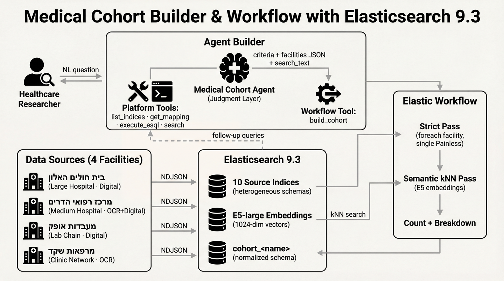

# Medical Cohort Agent

An AI agent that builds normalized patient cohorts from heterogeneous medical records — discharge summaries, lab results, visit summaries, and referrals — where **schema variance across facilities** is the core challenge.

Built for the [Elasticsearch Agent Builder Hackathon](https://elasticsearch.devpost.com/).

> **Disclaimer:** This project generates and uses **entirely synthetic data** for demos and research. No real patient information is used or produced. Facility names are fictional. This is not medical software and must not be used for clinical decisions.

## The Problem

A major HMO in Israel operates hundreds of clinics and hospitals. Patient records are scattered across facilities, each with its own:
- **Field naming conventions** (`patient_age` vs `גיל` vs `age_group`)
- **Data types** (age as integer vs string range "30-40")
- **ID formats** (string with leading zeros vs integer vs float artifact)
- **Date formats** (`yyyy-MM-dd` vs `dd/MM/yyyy` vs `dd.MM.yy`)
- **Data sources** (clean digital records vs noisy OCR from scanned documents)
- **Missing fields** (some facilities track smoking status, some don't)

Researchers currently navigate this manually across thousands of records to build patient cohorts for clinical studies.

## The Solution

An Elastic Agent Builder agent that creates **reusable cohort artifacts** — normalized, queryable Elasticsearch indices — from natural language research questions.

Unlike generic NL→query RAG patterns, the agent:
1. **Plans** structured criteria from the research question (judgment layer)
2. **Explains** data availability caveats per facility before executing
3. **Executes** a workflow that normalizes data from all 4 facilities into a single cohort index
4. **Classifies** each match as **strict** (structured field match) or **probable** (semantic kNN match)
5. **Enables** follow-up analysis on the cohort index without re-querying raw data
6. **Persists provenance** per match (source field aliases + evidence snippet) for auditability

The cohort index is the artifact — a researcher can query it, share it, or build on it.

## How It Works

### Step 1: Researcher asks a question

In the Kibana Agent Builder UI (or via API), the researcher types a natural language query:

```
מצא חולי סוכרת מעל גיל 60 שמעשנים
(Find diabetic patients over 60 who smoke)
```

### Step 2: Agent plans criteria

The agent (judgment layer) translates the question into structured criteria and explains caveats **before** executing:

```json
{
  "cohort_name": "diabetes_smokers_over_60",
  "conditions": ["סוכרת סוג 2"],
  "age_min": 61,
  "smoking": "true",
  "search_text": "מצא חולי סוכרת מעל גיל 60 שמעשנים"
}
```

> "Hadarim doesn't have a smoking field — patients from there will be matched via clinical text only (probable).
> Shaked stores age as ranges (60-70), not exact values.
> Ofek is lab-only — no conditions or smoking data."

### Step 3: Workflow executes (two passes)

The `build_cohort` workflow runs automatically:

**Strict pass** — Iterates over agent-provided facility configs (`foreach`) and reindexes patients using a single parameterized Painless script. The agent discovers schemas and builds field maps; the workflow normalizes generically via `params.f_*` (source field names) and `params.t_*` (type hints).

**Semantic kNN pass** — Uses E5 embeddings to find patients whose clinical notes are semantically similar to the research question. This catches what structured matching misses:
- **OCR artifacts**: `סוכדת` instead of `סוכרת` (diabetes misspelled by OCR)
- **Synonyms**: "elevated glucose levels" mentioned without the word "diabetes"
- **Negation**: "not a smoker" vs "smoker" — kNN understands the difference, substring matching doesn't

### Step 4: Cohort is ready

The workflow creates a `cohort_diabetes_smokers_over_60` index with normalized records:

```
Total: 96 patients
  Strict: 36  (matched via structured fields)
  Probable: 60 (matched via semantic similarity of clinical text)

By facility:
  מרכז רפואי הדרים: 49
  בית חולים האלון: 24
  מרפאות שקד: 23
```

### Step 5: Follow-up analysis

The researcher continues the conversation — the agent queries the cohort index directly:

```
Researcher: באילו מחלקות טופלו?
(Which departments were they treated in?)
```

Agent runs ES|QL on `cohort_diabetes_smokers_over_60` → returns department breakdown.

```
Researcher: הראה לי את ההתאמות הסבירות - למה הן לא ודאיות?
(Show me the probable matches — why aren't they certain?)
```

Agent queries `match_confidence: "probable"` → shows per-patient explanations.

## Architecture



### Two-Layer Design

| Layer | Role | How |
|-------|------|-----|
| **Agent** (judgment + discovery) | Discovers facility schemas, builds field maps, plans criteria, explains caveats, reports results | LLM + Agent Builder platform tools |
| **Workflow** (execution) | Normalizes data from any number of facilities via parameterized foreach, runs kNN, creates cohort index | Elastic Workflow YAML — deterministic, no LLM |

The agent discovers schemas (via `list_indices`, `get_index_mapping`, `search`), builds field maps, and passes them as `facilities` JSON to the workflow. The workflow normalizes generically — adding a new facility requires no code changes, only the agent discovering and mapping its schema.

### Production Architecture

In production, this runs air-gapped on a single VM:
- **LLM**: Ollama + Qwen 3 30B (local inference, no cloud dependency — see [LLM Tool Calling findings](docs/LLM-TOOL-CALLING.md))
- **Embeddings**: E5-large via Ollama (1024-dim vectors for semantic search)
- **Stack**: Elasticsearch 9.3 + Kibana (Agent Builder)

The architecture is LLM-agnostic — works with any model that supports OpenAI-compatible tool calling (see [docs/LLM-TOOL-CALLING.md](docs/LLM-TOOL-CALLING.md) for validated models).

## Schema Variance

The same patient appears across facilities with different representations:

| Concept | בית חולים האלון | מרכז רפואי הדרים | מעבדות אופק | מרפאות שקד |
|---------|----------------|-------------------|-------------|------------|
| Patient ID | `patient_id: "012345678"` | `מספר_זהות: 12345678` | `patient_id: "012345678"` | `tz: 12345678.0` |
| Age | `patient_age: 67` | `גיל: 67` | `age: 67` | `age_group: "60-70"` |
| Date | `2024-03-15` | `15/03/2024` | `15.03.24` | `2024-03` |
| Smoking | `smoking_status: true` | *(not tracked)* | *(not tracked)* | `smoking: true` |
| Free text | `clinical_notes` | `סיכום_רפואי` | `notes` | `text` |
| Department | `department` | `מחלקה` | *(N/A — lab only)* | `yechida` |

The agent discovers these schemas and builds field maps. The workflow normalizes generically using a single parameterized Painless script for the strict pass and nested `foreach` for the kNN pass.

## Cohort Index Schema

After the workflow runs, `cohort_<name>` contains normalized records:

| Field | Type | Description |
|-------|------|-------------|
| `patient_id` | keyword | Always string, leading zeros preserved |
| `patient_name` | text+keyword | |
| `age` | integer | Midpoint for ranges (Shaked strict pass) |
| `age_raw` | keyword | Original: "67" or "60-70" |
| `gender` | keyword | |
| `conditions` | keyword[] | Strict: array. Probable: concatenated string (Liquid limitation) |
| `medications` | keyword[] | Same as conditions |
| `icd10_codes` | keyword[] | Same as conditions |
| `smoking` | keyword | "true"/"false"/"unknown" |
| `department` | keyword | |
| `diagnosis` | text+keyword | |
| `clinical_notes` | text | Primary field for probable matches |
| `evidence_snippet` | text | Auto-derived preview of `clinical_notes` (first ~220 chars) |
| `text_embedding` | dense_vector(1024) | E5 embedding (strict pass only) |
| `source_facility` | keyword | Hebrew facility name |
| `source_index` | keyword | Original ES index |
| `match_confidence` | keyword | "strict" or "probable" |
| `match_explanation` | text | Human-readable caveats |
| `knn_score` | float | kNN similarity score (probable matches only) |
| `source_field_map` | object | Per-doc source field aliases used for normalization |

## Setup

### Prerequisites
- Podman (or Docker) with compose
- Python 3.11+
- **LLM** — one of:
  - **Cloud AI (easiest):** OpenAI API key — set `OPENAI_API_KEY` in `.env`, or use Elastic EIS configured directly from Kibana
  - **Local Ollama (air-gapped):** Requires GPU and a model with tool calling support (see [docs/LLM-TOOL-CALLING.md](docs/LLM-TOOL-CALLING.md))

Ollama for E5 embeddings runs inside a container (part of `docker-compose.yml`) — no system install needed. The E5 model runs on CPU, no GPU required.

### Quickstart

```bash
cp .env.example .env
# Edit .env:
#   - Set ELASTIC_PASSWORD and KIBANA_PASSWORD
#   - Set OPENAI_API_KEY for cloud AI (or use Elastic EIS from Kibana)  (or uncomment OLLAMA_LLM_URL/OLLAMA_LLM_MODEL for local LLM)
#   - Embedding defaults work out of the box (Ollama E5 runs in a container)

bash scripts/demo_setup.sh
```

This starts ES + Kibana + Ollama (all via podman), pulls the E5 model, loads sample data with embeddings, and sets up the agent. Ollama runs inside a container — no system install needed. E5 runs on CPU (takes a few minutes first time).

<details>
<summary>Override options</summary>

```bash
# Skip embeddings (strict pass only — no semantic kNN matching, no Ollama needed)
bash scripts/demo_setup.sh --no-embed

# Regenerate synthetic data instead of using pre-shipped samples
pip install e2llm-medsynth
e2llm-medsynth --verbose --output-dir sample_data
bash scripts/demo_setup.sh
```

</details>

### Manual Setup

<details>
<summary>Step-by-step (if not using the quickstart script)</summary>

#### 1. Start the Stack

```bash
cp .env.example .env
# Edit .env — see comments inside for options

podman-compose up -d
# Wait for ES + Kibana + Ollama to be healthy (~30s)
```

#### 2. Set Kibana System Password

Required after every fresh volume:

```bash
source .env
curl -s -u elastic:${ELASTIC_PASSWORD} -X POST \
  "http://localhost:9200/_security/user/kibana_system/_password" \
  -H 'Content-Type: application/json' \
  -d "{\"password\": \"${KIBANA_PASSWORD}\"}"
```

#### 3. Pull E5 Model + Create Inference Endpoint

The E5 model runs inside the Ollama container (started in step 1). Pull it, then create the inference endpoint that the workflow uses for kNN search:

```bash
source .env

# Pull E5 into the Ollama container (downloads ~2GB, runs on CPU)
curl -s "${OLLAMA_HOST_URL:-http://localhost:11434}/api/pull" \
  -d '{"name": "'${EMBED_MODEL:-qllama/multilingual-e5-large}'"}'

# Create inference endpoint (ES → Ollama, container-to-container)
curl -s -u elastic:${ELASTIC_PASSWORD} -X PUT \
  "http://localhost:9200/_inference/text_embedding/e5_embedder" \
  -H 'Content-Type: application/json' -d '{
  "service": "openai",
  "service_settings": {
    "api_key": "not-needed",
    "url": "'${OLLAMA_URL}'/v1/embeddings",
    "model_id": "'${EMBED_MODEL}'",
    "dimensions": 1024
  }
}'
```

#### 4. Load Data

```bash
pip install -r requirements.txt
python elasticsearch/generate_templates.py
python elasticsearch/bulk_index.py --data-dir sample_data --recreate --embed
```

The `--embed` flag generates E5 embeddings for each document's clinical text via Ollama (runs on CPU, no GPU needed). This populates the `text_embedding` field used by the kNN pass.

Without embeddings (strict pass only — kNN semantic matching won't work):
```bash
python elasticsearch/bulk_index.py --data-dir sample_data --recreate
```

#### 5. Set Up the Agent

```bash
python agent/setup.py
```

This creates an OpenAI LLM connector (using `OPENAI_API_KEY` from `.env`), imports the workflow, registers the workflow tool, and creates the agent. For local Ollama as LLM, create the connector manually in Kibana — see [docs/LLM-TOOL-CALLING.md](docs/LLM-TOOL-CALLING.md) for connector setup and model selection.

Enable workflows in Kibana: **Stack Management** → **Advanced Settings** → `workflows:ui:enabled` → ON.

</details>

### Use the Agent

**Kibana UI:** `http://localhost:5601` → Agent Builder → "Medical Cohort Agent" → select your LLM connector → type your research question.

**API:**
```bash
source .env
CONNECTOR_ID=$(curl -s -u elastic:${ELASTIC_PASSWORD} \
  http://localhost:5601/api/actions/connectors \
  -H 'kbn-xsrf: true' -H 'elastic-api-version: 2023-10-31' | \
  python3 -c "import sys,json; print([c['id'] for c in json.load(sys.stdin) if c.get('connector_type_id')=='.gen-ai'][0])")

curl -s -u elastic:${ELASTIC_PASSWORD} -X POST \
  http://localhost:5601/api/agent_builder/converse \
  -H 'kbn-xsrf: true' -H 'Content-Type: application/json' \
  -d "{\"agent_id\":\"medical-data-agent\",\"connector_id\":\"${CONNECTOR_ID}\",\"input\":\"מצא חולי סוכרת מעל גיל 60 שמעשנים\"}"
```

The response includes `conversation_id` — pass it back in subsequent requests to continue the conversation (follow-up queries on the same cohort).

## Data Quality Challenges

The synthetic data includes realistic noise patterns:

- **~6% garbage records**: age=0, empty required fields, over-generic locations
- **~18% contradictions**: structured field says one thing, clinical text says another
- **OCR artifacts** (OCR-sourced facilities): Hebrew character confusion (ר↔ד, ה↔ח, ב↔כ), merged words (`קוצרנשימה`), split words (`אשפ וז`)
- **OCR field distortions**: `השמנת יתר` → `חשמנת יתר`, `אנדוקרינולוגיה` → `אנדוקרינולוניה`
- **Type variance**: same concept stored as different types across facilities

The kNN semantic pass is specifically designed to handle OCR artifacts — E5 embeddings are robust to character-level noise that breaks exact matching.

Reproducible "mess metrics" from the sample corpus:
```bash
python3 scripts/metrics.py --data-dir sample_data
```

## Generate Your Own Data

> The default setup uses pre-shipped sample data in `sample_data/`. Only use this section if you want to regenerate from scratch.

The synthetic data generator is a separate package: [e2llm-medsynth](https://pypi.org/project/e2llm-medsynth/).

```bash
pip install e2llm-medsynth

# Structured data only (no LLM needed)
e2llm-medsynth --verbose --skip-freetext --num-patients 500 --output-dir sample_data

# With free text via cloud AI
LLM_API_KEY=sk-... e2llm-medsynth --api-base https://api.openai.com/v1 --model gpt-4o \
  --verbose --output-dir sample_data

# With free text via local Ollama (requires GPU)
ollama pull ${OLLAMA_LLM_MODEL:-qwen3:30b}
e2llm-medsynth --verbose --output-dir sample_data

# Then re-index
python elasticsearch/generate_templates.py
python elasticsearch/bulk_index.py --data-dir sample_data --recreate --embed
```

e2llm-medsynth supports 6 locales (he_IL, ar_SA, ar_EG, es_ES, es_MX, es_AR) — this project uses `he_IL`.

## API Reference

### Converse (chat with agent)

```
POST /api/agent_builder/converse
Headers: kbn-xsrf: true, Content-Type: application/json
Auth: Basic (elastic user)

Body:
{
  "agent_id": "medical-data-agent",
  "connector_id": "<connector-id>",
  "input": "your question in Hebrew or English",
  "conversation_id": "<optional, to continue a conversation>"
}

Response:
{
  "conversation_id": "...",
  "steps": [...],
  "response": { "message": "..." },
  "model_usage": { "input_tokens": ..., "output_tokens": ..., "llm_calls": ... }
}
```

### List agents / tools

```
GET /api/agent_builder/agents
GET /api/agent_builder/tools
Headers: kbn-xsrf: true
```

## Server Migration

Named volumes make the stack portable:

```bash
# Export
podman-compose down
podman volume export hackaton-es-data > hackaton-es-data.tar
podman volume export hackaton-kibana-data > hackaton-kibana-data.tar
podman volume export hackaton-ollama-data > hackaton-ollama-data.tar

# Import on new server
podman volume create hackaton-es-data && podman volume import hackaton-es-data < hackaton-es-data.tar
podman volume create hackaton-kibana-data && podman volume import hackaton-kibana-data < hackaton-kibana-data.tar
podman volume create hackaton-ollama-data && podman volume import hackaton-ollama-data < hackaton-ollama-data.tar
podman-compose up -d
```

## Troubleshooting

| Issue | Solution |
|-------|----------|
| ES won't start | Check `ES_JAVA_OPTS` — need at least 1g |
| Kibana 503 | `kibana_system` password not set — run step 2 |
| Connectors API 500 | Missing `xpack.encryptedSavedObjects.encryptionKey` in `kibana.yml` |
| Workflows page not visible | Advanced Settings → `workflows:ui:enabled` → ON |
| Workflow import 404 | `x-elastic-internal-origin: Kibana` header required |
| Cohort index empty | Check source indices have data; check criteria aren't too restrictive |
| 0 probable matches | Embeddings missing — reindex with `--embed`; check Ollama and `e5_embedder` endpoint |
| Agent not visible | Ensure trial license: `GET /_license` |
| Embedding timeout | Ollama container not ready — check `podman logs hackaton-ollama`; verify E5 model pulled (`curl localhost:11434/api/tags`) |

### Key Gotchas

- `xpack.encryptedSavedObjects.encryptionKey` **must** be in `kibana.yml` (env var with dots doesn't work in Kibana 9.3)
- Workflow API (`POST /api/workflows`) requires `x-elastic-internal-origin: Kibana` header — internal API
- Agent Builder API needs `id` + `configuration.tools` in the body (not path params)
- The `elastic-api-version: 2023-10-31` header is needed for connectors but not converse
- **ES|QL multi-field chart breakdown is broken in Kibana 9.3** ([#236682](https://github.com/elastic/kibana/issues/236682), fixed in 9.4). `STATS ... BY field1, field2` produces mangled charts because Lens can only split on a single accessor. Workaround: `EVAL breakdown = CONCAT(field1, " — ", field2) | STATS count = COUNT(*) BY breakdown`

## Project Structure

```
├── docker-compose.yml           # ES 9.3 + Kibana + Ollama (E5 embeddings)
├── kibana.yml                   # Kibana config (encryption key)
├── .env.example                 # Configuration
├── workflow/
│   ├── build_cohort.yaml        # Elastic Workflow (7 steps, generic foreach)
│   └── README.md                # Workflow details
├── elasticsearch/
│   ├── index_templates/         # Generated ES mappings (with dense_vector)
│   ├── generate_templates.py    # Template generator (uses e2llm-medsynth)
│   └── bulk_index.py            # NDJSON → ES loader (with --embed)
├── agent/
│   ├── agent_config.json        # Agent instructions + normalized schema + DISCOVER phase
│   └── setup.py                 # Kibana API setup (connector + agent + tools)
├── scripts/
│   ├── demo_setup.sh            # One-command demo setup (stack + data + agent)
│   └── metrics.py               # Reproducible "mess metrics" from sample corpus
└── sample_data/                 # Pre-generated NDJSON (500 patients, 2053 docs, 10 indices)
```

## License

MIT
